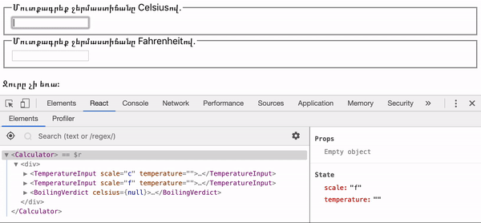

Հաճախ, մի քանի կոմպոնենտներ պետք է անդրադարձնեն նույն փոփոխվող տվյալները։ Մենք խորհուրդ ենք տալիս բարձրացնել ընդհանուր վիճակը դեպի նրանց մոտակա ընդհանուր ծնող։ Եկեք տեսնենք, թե ինչպես է դա աշխատում.

Այս բաժնում մենք կստեղծենք ջերմաստիճանի հաշվիչ, որը հաշվում է, թե տրված ջերմաստիճանում արդյոք կեռա ջուրը։

Մենք կսկսենք կոմպոնենտից, որը կոչվում է `BoilingVerdict`։ Այն ընդունում է `celsius` prop որպես ջերմաստիճան և տպում է, թե արդյոք դա բավարար է ջրի եռման համար.

```js{3,5}
function BoilingVerdict(props) {
  if (props.celsius >= 100) {
    return <p>Ջուրը կեռա։</p>;
  }
  return <p>Ջուրը չի եռա։</p>;
}
```

Հաջորդիվ մենք կստեղծենք կոմպոնենտ, որը կոչվում է `Calculator`։ Այն արտապատկերում է `<input>`, որը թույլ է տալիս ձեզ մուտքագրել ջերմաստիճանը և պահում է նրա արժեքը `this.state.temperature`-ում։

Բացի այդ, այն արտապատկերում է `BoilingVerdict`-ը ընթացիկ մուտքագրված արժեքի համար։

```js{5,9,13,17-21}
class Calculator extends React.Component {
  constructor(props) {
    super(props);
    this.handleChange = this.handleChange.bind(this);
    this.state = {temperature: ''};
  }

  handleChange(e) {
    this.setState({temperature: e.target.value});
  }

  render() {
    const temperature = this.state.temperature;
    return (
      <fieldset>
        <legend>Մուտքագրեք ջերմաստիճանը Ցելսիուսով.</legend>
        <input
          value={temperature}
          onChange={this.handleChange} />
        <BoilingVerdict
          celsius={parseFloat(temperature)} />
      </fieldset>
    );
  }
}
```

[**Փորձել CodePen-ում**](https://codepen.io/gaearon/pen/ZXeOBm?editors=0010)

## Ավելացնել երկրորդ Input-ը {#adding-a-second-input}

Մեր նոր պահանջն այն է, որ բացի Ցելսիուսի input-ից մենք տրամադրենք input Ֆարենհայթի համար և նրանք լինեն համաձայնեցված (in sync)։

Մենք կարող ենք սկսել `TemperatureInput` կոմպոնենտի տարանջատումից։ Մենք կավելացնենք նոր `scale` prop, որը կարող է լինեն «c» կամ «f».

```js{1-4,19,22}
const scaleNames = {
  c: 'Ցելսիուս',
  f: 'Ֆարենհայթ'
};

class TemperatureInput extends React.Component {
  constructor(props) {
    super(props);
    this.handleChange = this.handleChange.bind(this);
    this.state = {temperature: ''};
  }

  handleChange(e) {
    this.setState({temperature: e.target.value});
  }

  render() {
    const temperature = this.state.temperature;
    const scale = this.props.scale;
    return (
      <fieldset>
        <legend>Մուտքագրեք ջերմաստիճանը {scaleNames[scale]}ով.</legend>
        <input value={temperature}
               onChange={this.handleChange} />
      </fieldset>
    );
  }
}
```

Այժմ մենք կարող ենք փոխել `Calculator`-ը, որպեսզի արտապատկերենք երկու առանձին ջերմաստիճանի input-ներ.

```js{5,6}
class Calculator extends React.Component {
  render() {
    return (
      <div>
        <TemperatureInput scale="c" />
        <TemperatureInput scale="f" />
      </div>
    );
  }
}
```

[**Փորձել CodePen-ում**](https://codepen.io/gaearon/pen/jGBryx?editors=0010)

Հիմա մենք ունենք երկու input, բայց երբ մուտքագրում եք ջերմաստիճանը նրանցից մեկում, մյուսը չի թարմանում։ Սա հակասում է մեր պահանջին. մենք ցանկանում ենք պահել նրանց համաձայնեցված։

Նաև մենք չենք կարող պատկերել `BoilingVerdict`-ը `Calculator`-ից։ `Calculator`-ը չգիտի ընթացիկ ջերմաստիճանը, որովհետև այն (ջերմաստիճանը) թաքցված է `TemperatureInput`-ի ներսում։

## Գրել փոխակերպող ֆունկցիաներ {#writing-conversion-functions}

Նախ, մենք կգրենք երկու ֆունկցիա\` փոխակերպելու համար Ցելսիուսը Ֆարենհայթով, և հակառակը.

```js
function toCelsius(fahrenheit) {
  return (fahrenheit - 32) * 5 / 9;
}

function toFahrenheit(celsius) {
  return (celsius * 9 / 5) + 32;
}
```

Այս երկու ֆունկցիաները փոխակերպում են թվեր։ Մենք կգրենք մեկ այլ ֆունկցիա, որը ստանում է `temperature` տող և փոխակերպող ֆունկցիա որպես արգումենտներ ու վերադարձնում է տող։ Մենք կօգտագործենք այն\` հաշվելու համար մեկի արժեքը հիմնվելով մյուսի վրա։

Այն վերադարձնում է դատարկ տող ոչ վավեր `temperature`-ի դեպքում և պահում է ելքային արժեքը կլորեցված 1000-րդականի ճշտությամբ.

```js
function tryConvert(temperature, convert) {
  const input = parseFloat(temperature);
  if (Number.isNaN(input)) {
    return '';
  }
  const output = convert(input);
  const rounded = Math.round(output * 1000) / 1000;
  return rounded.toString();
}
```

Օրինակ, `tryConvert('abc', toCelsius)`-ը վերադարձնում է դատարկ տող, իսկ `tryConvert('10.22', toFahrenheit)`-ը\` `'50.396'`։

## Վիճակի բարձրացում {#lifting-state-up}

Այս պահին երկու `TemperatureInput` կոմպոնենտներն էլ անկախ պահում են իրենց արժեքները լոկալ state-ում.

```js{5,9,13}
class TemperatureInput extends React.Component {
  constructor(props) {
    super(props);
    this.handleChange = this.handleChange.bind(this);
    this.state = {temperature: ''};
  }

  handleChange(e) {
    this.setState({temperature: e.target.value});
  }

  render() {
    const temperature = this.state.temperature;
    // ...  
```

Ինչևէ, մենք ցանկանում ենք, որ այս երկու input-ները լինեն միմյանց հետ համաձայնեցված։ Երբ մենք թարմացնենք Ցելսիուս input-ը, Ֆարենհայթի input-ը պետք է արտացոլի փոխակերպված ջերմաստիճանը, և հակառակը։

React-ում, վիճակով կիսվելը իրականացվում է նրա տեղափոխումով դեպի դրա կարիքը ունեցող կոմպոնենտների մոտակա ընդհանուր ծնող։ Սա անվանվում է «վիճակի բարձրացում»։ Մենք կջնջենք լոկալ state-ը `TemperatureInput`-ից և կտեղափոխենք այն `Calculator`։

Եթե ընդհանուր վիճակը լինի `Calculator`-ում, ապա այն կդառնա «ճշմարտության աղբյուր» ընթացիկ ջերմաստիճանի համար երկու input-ներում։ Այն կարող է տրամադրել նրանց միմյանց չհակասող արժեքներ։ Քանի որ երկու `TemperatureInput` կոմպոնենտների prop-երը գալիս են նույն ծնող `Calculator` կոմպոնենտից, ապա երկու input-ները կլինեն համաձայնեցված։

Եկեք տեսնենք, թե ինչպես է սա աշխատում քայլ-առ-քայլ։

Նախ, մենք կփոխարինենք `this.state.temperature`-ը `this.props.temperature`-ով `TemperatureInput` կոմպոնենտում։ Եկեք այժմ ենթադրենք, որ `this.props.temperature` արդեն գոյություն ունի, չնայած ապագայում մենք պետք է փոխանցենք այն `Calculator`-ից։

```js{3}
  render() {
    // Նախկինում: const temperature = this.state.temperature;
    const temperature = this.props.temperature;
    // ...
```

Մենք գիտենք, որ [prop-երը միայն կարդալու համար են](/docs/components-and-props.html#props-are-read-only)։ Երբ `temperature`-ը լոկալ state-ում էր, `TemperatureInput`-ը կարող էր ընդամենը կանչել `this.setState()`\` այն թարմացնելու համար։ Ինչևէ, հիմա, երբ `temperature`-ը գալիս է ծնողից որպես prop, `TemperatureInput`-ը չունի վերահսկողություն դրա վրա։

React-ում սա սովորաբար լուծվում է\` դարձնելով կոմպոնենտը «կառավարվող»։ Ինչպես DOM `<input>`-ն է ընդունում և՛ `value` և՛ `onChange` prop, այդպես էլ օգտագործողի `TemperatureInput`-ը կարող է ընդունել և՛ `temperature` և՛ `onTemperatureChange` prop իր ծնողից։

Հիմա, երբ `TemperatureInput`-ը ցանկանում է թարմացնել իր ջերմաստիճանը, այն կանչում է `this.props.onTemperatureChange`.

```js{3}
  handleChange(e) {
    // Նախկինում: this.setState({temperature: e.target.value});
    this.props.onTemperatureChange(e.target.value);
    // ...
```

>Նշում:
>
>Օգտագործողի կոմպոնենտներում չկա հատուկ նշանակություն ոչ՛ `temperature`-ի, ոչ՛ էլ `onTemperatureChange` prop-երի անուներում։ Մենք կարող էինք անվանել նրանց ցանկացած ուրիշ կերպ, օրինակ `value` և `onChange`, որոնք հանդիսանում են ընդհանուր պայմանավորվածություն։

`onTemperatureChange` prop-ը կտրամադրվի `temperature` prop-ի հետ միասին `Calculator` ծնող կոմպոնենտից։ Վերջինս կմշակի փոփոխությունները\` փոխելով իր սեփական լոկալ state-ը. այսպիսով վերա-արտապատկերելով երկու input-ները նոր արժեքներով։ Մենք կտեսնենք `Calculator`-ի նոր իրականացումը շուտով։

Մինչ `Calculator`-ի փոփոխությունների մեջ սուզվելը, եկեք իմի բերենք մեր փոփոխությունները `TemperatureInput` կոմպոնենտում։ Մենք ջնջել ենք լոկալ state-ն այդտեղից և `this.state.temperature`-ը կարդալու փոխարեն կարդում ենք `this.props.temperature`-ը։ Երբ ցանկանում ենք փոփոխություն անել, `this.setState()` կանչելու փոխարեն մենք կանչում ենք `this.props.onTemperatureChange()`-ը, որը կտրամադրվի `Calculator`-ի կողմից։

```js{8,12}
class TemperatureInput extends React.Component {
  constructor(props) {
    super(props);
    this.handleChange = this.handleChange.bind(this);
  }

  handleChange(e) {
    this.props.onTemperatureChange(e.target.value);
  }

  render() {
    const temperature = this.props.temperature;
    const scale = this.props.scale;
    return (
      <fieldset>
        <legend>Մուտքագրեք ջերմաստիճանը {scaleNames[scale]}ով.</legend>
        <input value={temperature}
               onChange={this.handleChange} />
      </fieldset>
    );
  }
}
```

Հիմա եկեք տեղափոխվենք `Calculator` կոմպոնենտ։

Մենք կպահենք ընթացիկ input-ի `temperature`-ը և `scale`-ը նրա լոկալ state-ում։ Սա input-ներից «բարձրացրած» state-ն է, և այն ծառայելու է որպես «ճշմարտության աղբյուր» նրանց երկուսի համար։ Սա մինիմալ ներկայացումն է բոլոր տվյալների, որոնց մասին մենք պետք է իմանանք երկու input-ները արտապատկերելու համար։

Օրինակ, եթե մենք մուտքագրենք 37 Ցելսիուսի input-ում, `Calculator` կոմպոնենտի state-ում կլինի.

```js
{
  temperature: '37',
  scale: 'c'
}
```

Հետո, եթե խմբադրենք Ֆարենհայթ դաշտը 212-ի, `Calculator`-ի state-ը կլինի.

```js
{
  temperature: '212',
  scale: 'f'
}
```

Մենք կարող էինք պահել երկու input-ների արժեքները, բայց դա կլիներ ավելորդ։ Բավական է ընդամենը պահել ամենավերջում փոխված արժեքը և այն ցույց տվող սանդղակը։ Հետո մենք կարող ենք դուրս բերել մյուս input-ի արժեքը\` հիմնվելով միայն ընթացիկ `temperature`-ի և `scale`-ի վրա։

input-ները մնում են համաձայնեցված, որովհետև նրանց արժեքները հաշվվում են նույն state-ից.

```js{6,10,14,18-21,27-28,31-32,34}
class Calculator extends React.Component {
  constructor(props) {
    super(props);
    this.handleCelsiusChange = this.handleCelsiusChange.bind(this);
    this.handleFahrenheitChange = this.handleFahrenheitChange.bind(this);
    this.state = {temperature: '', scale: 'c'};
  }

  handleCelsiusChange(temperature) {
    this.setState({scale: 'c', temperature});
  }

  handleFahrenheitChange(temperature) {
    this.setState({scale: 'f', temperature});
  }

  render() {
    const scale = this.state.scale;
    const temperature = this.state.temperature;
    const celsius = scale === 'f' ? tryConvert(temperature, toCelsius) : temperature;
    const fahrenheit = scale === 'c' ? tryConvert(temperature, toFahrenheit) : temperature;

    return (
      <div>
        <TemperatureInput
          scale="c"
          temperature={celsius}
          onTemperatureChange={this.handleCelsiusChange} />
        <TemperatureInput
          scale="f"
          temperature={fahrenheit}
          onTemperatureChange={this.handleFahrenheitChange} />
        <BoilingVerdict
          celsius={parseFloat(celsius)} />
      </div>
    );
  }
}
```

[**Փորձել CodePen-ում**](https://codepen.io/gaearon/pen/WZpxpz?editors=0010)

Այժմ, անկախ նրանից, թե որ input-ն եք դուք խմբագրում, `Calculator`-ում `this.state.temperature`-ը և `this.state.scale`-ը կթարմացվեն։ input-ներից մեկը ստանում է արժեքը այնպես ինչպես կա (այսպիսով օգտագործողի ցանկացած մուտքագրում պահպանվում է), իսկ մյուս input-ի արժեքը միշտ վերահաշվարկվում է հիմնվելով դրա վրա։

Եկեք իմի բերենք, թե ինչ է տեղի ունենում, երբ դուք խմբագրում եք input-ը.

<<<<<<< HEAD
* React-ը կանչում է DOM `<input>`-ի վրա որպես `onChange` սահմանված ֆունկցիան։ Մեր պարագայում դա `TemperatureInput` կոմպոնենտի `handleChange` մեթոդն է։
* `TemperatureInput` կոմպոնենտի `handleChange` մեթոդը կանչում է `this.props.onTemperatureChange()`-ը նոր արժեքով։ Նրա prop-երը, ներառյալ\` `onTemperatureChange`, տրամադրված էին իր ծնող\` `Calculator` կոմպոնենտի կողմից։
* Երբ այն նախորդ անգամ արտապատկերվեց, `Calculator`-ը նշանակեց Ցելսիուսի `TemperatureInput`-ի `onTemperatureChange`-ը `Calculator`-ի `handleCelsiusChange` մեթոդով, և համապատասխանաբար, Ֆարենհայթի `TemperatureInput`-ի `onTemperatureChange`-ը `Calculator`-ի `handleFahrenheitChange` մեթոդով։ Այսպիսով, `Calculator`-ի այս երկու մեթոդներից որևէ մեկը կկանչվի կախված այն բանից, թե որ input-ն ենք խմբագրել։
* Այս մեթոդների ներսում `Calculator` կոմպոնենտը խնդրում է React-ին վերա-արտակատկերել ինքն իրեն\` կանչելով `this.setState()` հենց նոր խմբագրած input-ի արժեքով և ընթացիկ սանդղակով։
* React-ը կանչում է `Calculator` կոմպոնենտի `render` մեթոդը, որպեսզի իմանա, թե ինչ տեսք պետք է ունենա UI-ը։ Երկու input-ների արժեքները վերահաշվարկվում են\` հիմնված ընթացիկ ջերմաստիճանի և ակտիվ սանդղակի վրա։ Այստեղ է կատարվում ջերմաստիճանի փոխակերպումը։
* React-ը կանչում է ամեն մի առանձին `TemperatureInput` կոմպոնենտի `render` մեթոդը նրանց նոր prop-երով\` սահմանված `Calculator`-ի կողմից։ Այն հասկանում է, թե ինչ տեսք պետք է ունենա նրանց UI-ը։
* React-ը կանչում է `BoilingVerdict` կոմպոնենտի `render` մեթոդը\` փոխանցելով ջերմաստիճանը ցելսիուսով որպես նրա prop։
* ReactDOM-ը թարմացնում է DOM-ը «եռման որոշմամբ», որը հիմնված է input-ների արժեքների վրա։ input-ը, որը հենց նոր խմբագրեցինք, ստանում է իր ընթացիկ արժեքը, իսկ մյուսը թարմանում է ջերմաստիճանի փոխակերպումից հետո։
=======
* React calls the function specified as `onChange` on the DOM `<input>`. In our case, this is the `handleChange` method in the `TemperatureInput` component.
* The `handleChange` method in the `TemperatureInput` component calls `this.props.onTemperatureChange()` with the new desired value. Its props, including `onTemperatureChange`, were provided by its parent component, the `Calculator`.
* When it previously rendered, the `Calculator` had specified that `onTemperatureChange` of the Celsius `TemperatureInput` is the `Calculator`'s `handleCelsiusChange` method, and `onTemperatureChange` of the Fahrenheit `TemperatureInput` is the `Calculator`'s `handleFahrenheitChange` method. So either of these two `Calculator` methods gets called depending on which input we edited.
* Inside these methods, the `Calculator` component asks React to re-render itself by calling `this.setState()` with the new input value and the current scale of the input we just edited.
* React calls the `Calculator` component's `render` method to learn what the UI should look like. The values of both inputs are recomputed based on the current temperature and the active scale. The temperature conversion is performed here.
* React calls the `render` methods of the individual `TemperatureInput` components with their new props specified by the `Calculator`. It learns what their UI should look like.
* React calls the `render` method of the `BoilingVerdict` component, passing the temperature in Celsius as its props.
* React DOM updates the DOM with the boiling verdict and to match the desired input values. The input we just edited receives its current value, and the other input is updated to the temperature after conversion.
>>>>>>> 0bb0303fb704147452a568472e968993f0729c28

Յուրաքանչյուր թարմացում անցում է նույն քայլերով\` այդպիսով, պահելով input-ները համաձայնեցված։

## Քաղված դասեր {#lessons-learned}

Պետք է լինի «ճշմարտության աղբյուր» ցանկացած տվյալի համար React հավելվածներում։ Սովորաբար, state-ը ավելացվում է այն կոմպոնենտին, որին այն պետք է արտապատկերման համար։ Հետո, եթե ուրիշ կոմպոնենտներ նույնպես ունեն դրա կարիքը, կարող եք բարձրացնել այն դեպի նրանց մոտակա ծնող։ Փոխարենը փորձելու համաձայնեցնել տարբեր կոմպոնենտների վիճակներ, դուք պետք է հիմնվեք [վերևից-ներքև տվյալների հոսքի](/docs/state-and-lifecycle.html#the-data-flows-down) վրա։

Վիճակի բարձրացումը իր մեջ ներառում է ավելի շատ «ձևանմուշային» կոդ, քան «երկկողմանի կցման» (two-way binding) մոտեցումը, սակայն, որպես առավելություն, այն սխալներ գտնելու և մեկուսացնելու համար ավելի քիչ գործ է պահանջում։ Քանի որ ցանկացած state «ապրում» է ինչ-որ կոմպոնենտում և միայն այդ կոմպոնենտը կարող է փոխել այն, ապա սխալներ առաջանալու հնարավոր տեղերը զգալիորեն կրճատվում են։ Բացի դրանից կարող եք իրագործել ցանկացած տրամաբանություն օգտագործողի մուտքագրումը մերժելու կամ ձևափոխելու համար։

Եթե ինչ-որ բան կարող է ստացվել/հաշվարկվել props-ից կամ state-ից, ապա, հավանաբար, այն չպետք է լինի state-ում։ Օրինակ, `celsiusValue`-ը և `fahrenheitValue`-ը պահելու փոխարեն, պահում ենք միայն վերջին խմբագրված `temperature`-ը և նրա `scale`-ը։ Մյուս input-ի արժեքը միշտ կարող է հաշվվել նրանցից `render()` մեթոդում։ Դա թույլ է տալիս մեզ մաքրել կամ կիրառել կլորեցում մյուս դաշտի վրա\` առանց կորցնելու որևէ ճշտություն օգտագործողի մուտքագրումից։

<<<<<<< HEAD
Երբ տեսնում ենք ինչ-որ սխալ բան UI-ում, ապա կարող եք օգտագործել [React Developer Tools](https://github.com/facebook/react/tree/master/packages/react-devtools)<sub>`eng`</sub>\` դիտարկելու prop-երը և տեղաշարժվելու ծառով, մինչ գտնեք այն կոմպոնենտը, որը պատասխանատու է վիճակի թարմացման համար։ Սա թույլ կտա հետևել սխալներին մինչև սկզբնաղբյուրը.
=======
When you see something wrong in the UI, you can use [React Developer Tools](https://github.com/facebook/react/tree/main/packages/react-devtools) to inspect the props and move up the tree until you find the component responsible for updating the state. This lets you trace the bugs to their source:
>>>>>>> 0bb0303fb704147452a568472e968993f0729c28


