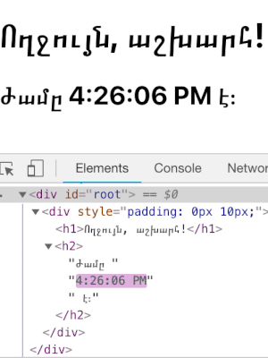

Էլեմենտները React հավելվածի փոքրագույն կառուցողական բլոկերն են։

Էլեմենտը նկարագրում է այն\` ինչ ցանկանում եք տեսնել էկրանին։

```js
const element = <h1>Ողջույն, աշխարհ</h1>;
```

Ի տարբերություն զննարկիչի DOM էլեմենտների\` React էլեմենտները իրենցից ներկայացնում են հասարակ օբյեկտներ և ռեսուրսատար չեն ստեղծման համար։ React DOM-ը համեմատելով էլեմենտները հոգ կտանի DOM-ը թարմացնելու համար։

>**Նշում.**
>
>Հնարավոր է շփոթել էլեմենտները մեկ այլ, ավելի հայտնի հասկացության\` կոմպոնենտի հետ։ Մենք կներկայացնենք կոմպոնենտները [հաջորդ բաժնում](/docs/components-and-props.html)։ Կոմպոնենտները կազմված են էլեմենտներից. այդ իսկ պատճառով, մինչ առաջ անցնելը, խորհուրդ ենք տալիս կարդալ այս բաժինը։

## Էլեմենտնի արտապատկերումը DOM-ում {#rendering-an-element-into-the-dom}

Ենթադրենք HTML ֆայլում որևէ տեղ ունենք հետևյալ `<div>` էլեմենտը։

```html
<div id="root"></div>
```

Մենք այն անվանում ենք «root» DOM հանգույց, որովհետև ամեն ինչը նրա ներսում ղեկավարվելու է React DOM-ի կողմից.

Սովորաբար React-ով ստեղծված հավելվածները ունեն մեկ արմատ (root) DOM հանգույց։ եթե դուք ինտեգրում եք React-ը արդեն գույություն ունեցող հավելվածին, ապա կարող եք ունենալ այնքան «root» DOM հանգույցներ որքան որ կցանկանաք։


React էլեմենտը արմատ DOM հանգույցում նկարելու համար, պետք է երկուսն էլ փոխանցել `ReactDOM.render()`-ին։

`embed:rendering-elements/render-an-element.js`

[Փորձել CodePen-ում](codepen://rendering-elements/render-an-element)

Այն էջում ցույց կտա «Ողջույն, աշխարհ»

## Թարմացնում ենք նկարված էլեմենտը {#updating-the-rendered-element}

React էլեմենտները [անփոփոխ են](https://en.wikipedia.org/wiki/Immutable_object)։ Էլեմենտի ստեղծման պահից հետո դուք չեք կարող փոխել նրա ատրիբուտները կամ զավակներին։ Էլելեմենտը նման է ֆիլմի մեկ կադրին\` այն ներկայացնում է UI-ը ժամանակի որոշակի պահին։

Այս պահի մեր գիտելիքներով UI-ը թարմացնելու միակ ձևը նոր էլեմենտ ստեղծելն ու փոխանցելն է `ReactDOM.render()`-ին։

Դիտարկեք այս ժամացույցի օրինակը.

`embed:rendering-elements/update-rendered-element.js`

[Փորձել CodePen-ում](codepen://rendering-elements/update-rendered-element)

Այն կանչում է `ReactDOM.render()`-ը [`setInterval()`](https://developer.mozilla.org/en-US/docs/Web/API/WindowTimers/setInterval)-ի հետկանչ ֆունկցիայից\` յուրաքանչյուր վարկյանը մեկ։

>**Նշում.**
>
>Գործնականում, React հավելվածների մեծամասնությունը `ReactDOM.render()`-ը կանչում է մեկ անգամ։ Հաջորդ բաժիններում մենք կսովորենք թե ինչպես է նմանատիպ կոդը ինկապսուլացվում [վիճակով կոմպոնենտ](/docs/state-and-lifecycle.html)-ներով։
>
>Խորհուրդ ենք տալիս բաց չթողնել թեմաները, քանի որ նրանք հիմնված են մեկը մյուսի վրա։

## React-ը թարմացնում է միայն այն ինչը անհրաժեշտ է {#react-only-updates-whats-necessary}

React DOM-ը համեմատում է էլեմենտը և նրա զավակներին նախորդների հետ, և կիրառում է DOM-ի թարմացում միայն անհրաժեշտության դեպքում\` DOM-ը ցանկալի վիճակին հասցնելու համար։

Դուք կարող եք համոզվել ստուգելով [նախորդ օրինակը](codepen://rendering-elements/update-rendered-element) զննարկիչի գործիքների օգնությամբ:



<<<<<<< HEAD
Չնայած նրան որ մեր ստեղծած էլեմենտը նկարագրում է ողջ UI ծառը յուրաքանչյուր tick-ի ժամանակ, React DOM-ը թարմացնում է միայն այն տեքստային հանգույցը, որի կոնտենտը ենթարկվել է փոփոխության։
=======
Even though we create an element describing the whole UI tree on every tick, only the text node whose contents have changed gets updated by React DOM.
>>>>>>> 821e20726266bc8113353d0c2b6d885f82e584a8

Փորձը ցույց է տալիս, որ մտածելը թե ինչ տեսք պետք է ունենա UI-ը յուրաքանչյուր պահին` վերացնում է սխալների մի ամբողջ դաս, քան մտածելը թե ինչպես փոխել UI-ը ժամանակի ընթացքում։
